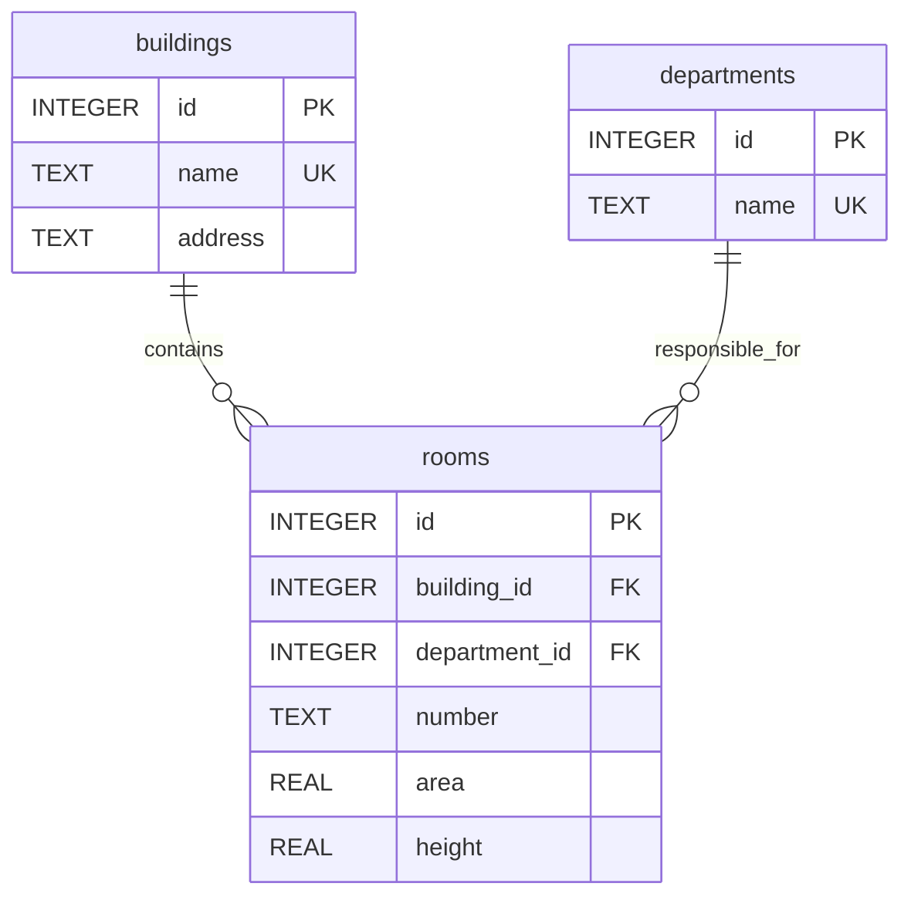

# Схема данных

Источник фактической схемы: `campus/schema.sql`.

Все поля обязательны. ID присваивает SQLite. `UNIQUE(building_id, number)`
защищает номер помещения в корпусе. Имена корпусов и подразделений уникальны
внутри соответствующих таблиц. Сравнение регистрозависимое.
Внешние ключи имеют `ON DELETE RESTRICT`; каскадного удаления помещений нет.

`volume` — вычисляемое поле API: `round(area * height, 2)`, не столбец таблицы.
Площадь измеряется в м², высота — в метрах, объём — в м³.
Названия: 1–100 символов; адрес: 1–250; номер: 1–30;
0 < площадь ≤ 100000, 0 < высота ≤ 100.

Настройка файла: `DATABASE_PATH`, по умолчанию `instance/campus.sqlite3`.
Относительный путь отсчитывается от корня проекта, не от текущего каталога shell.
Первый запуск выполняет `CREATE TABLE IF NOT EXISTS`, повторный сохраняет данные.
Это инициализация схемы ЛР1, а не система миграций последующих лабораторных.

Каждое изменение — отдельная транзакция. При ошибке `with db` откатывает запись.
Файл БД исключён из Git; тесты используют отдельные временные файлы.
